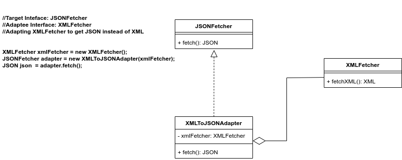

# UML Diagram


##### Please run the Client.java class, and it will log following information

```
[JSONFetcherImpl]: fetched json response: {name='product2', price=200}
[AnalyzerImpl]: analyzing resp: {name='product2', price=200}
[XMLFetcherImpl]: fetched xml response:      

     <product>
         <name>Product 1</name>
         <price>100</price>
     </product>

[XMLToJSONAdapter]: converting xml response:      

     <product>
         <name>Product 1</name>
         <price>100</price>
     </product>
 to json resp {name='Product 1', price=100}
[AnalyzerImpl]: analyzing resp: {name='Product 1', price=100}
```

You can modify the Client.java code to decorate or undecorate the Notifier
```
    Notifier notifier = new EmailNotifier();
    notifier = new FacebookNotifier(notifier);
    notifier = new SlackNotifier(notifier);
    notifier = new SMSNotifier(notifier);
    notifier.send();
```