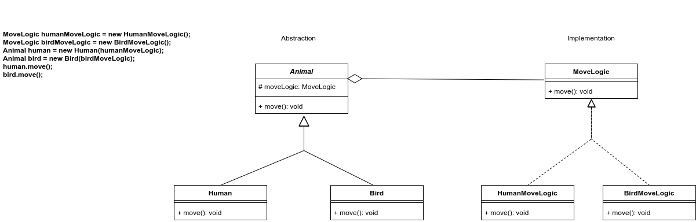

# UML Diagram


##### Please run the Client.java class, and it will log following information
```
[HumanMoveLogic]: Human is walking by alternating legs
[BirdMoveLogic]: Bird is flying by flapping wings
```

[Get more information](https://medium.com/@andreaspoyias/design-patterns-a-quick-guide-to-bridge-pattern-9ebf6a77baed)