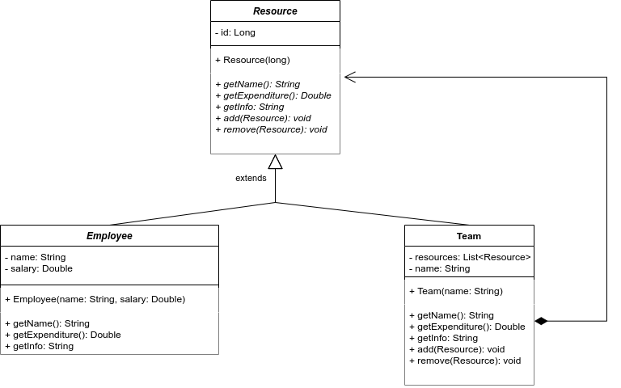

# UML Diagram


##### Please run the Client.java class, and it will log following information
```
----------------------------Techno-soft-----------------------------
Total Expenditure: 15.50

----------------------------Java Team-----------------------------
Total Expenditure: 10.50
Employee{name='ubaid', salary=9.0}
Employee{name='rizwan', salary=1.5}


----------------------------QA Team-----------------------------
Total Expenditure: 5.00
Employee{name='afeef', salary=2.0}
Employee{name='musab', salary=3.0}
```

[Get more information](https://howtodoinjava.com/design-patterns/structural/composite-design-pattern/)