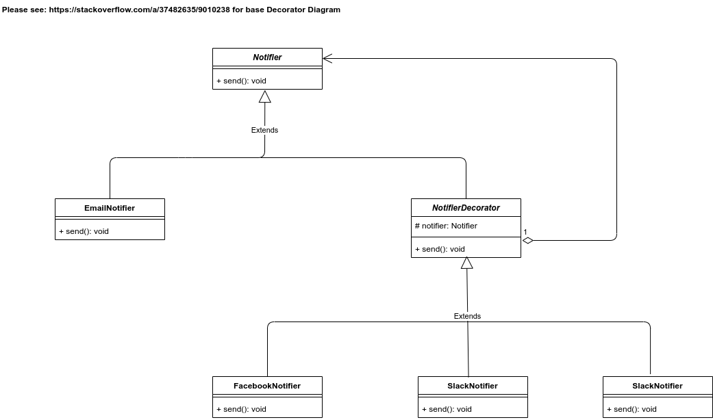

# UML Diagram


##### Please run the Client.java class, and it will log following information
```
Sending Email Notification
Sending Facebook notification
Sending Slack Notification
Sending SMS Notification
```

You can modify the Client.java code to decorate or undecorate the Notifier
```
    Notifier notifier = new EmailNotifier();
    notifier = new FacebookNotifier(notifier);
    notifier = new SlackNotifier(notifier);
    notifier = new SMSNotifier(notifier);
    notifier.send();
```