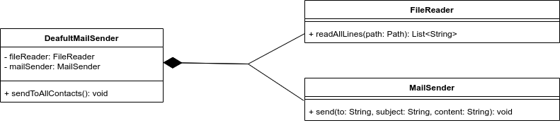

# UML Diagram


##### Please run the Client.java class, and it will log following information
```
[FileReaderImpl]: Reading all contacts from /home/ubaid/dev/24-design-patterns/out/production/24-design-patterns/structural/facade/allMailContacts.txt
[FileReaderImpl]: All contacts: [u1@gmail.com, u2@gmail.com, u3@gmail.com, u4@gmail.com, u5@gmail.com, u6@gmail.com, u7@gmail.com, u8@gmail.com, u9@gmail.com]
[MailSenderImpl]: Sending email {
subject=Good Morning,
content=Hello All, Good Morning
} to u1@gmail.com
[MailSenderImpl]: Sending email {
subject=Good Morning,
content=Hello All, Good Morning
} to u2@gmail.com
[MailSenderImpl]: Sending email {
subject=Good Morning,
content=Hello All, Good Morning
} to u3@gmail.com
[MailSenderImpl]: Sending email {
subject=Good Morning,
content=Hello All, Good Morning
} to u4@gmail.com
[MailSenderImpl]: Sending email {
subject=Good Morning,
content=Hello All, Good Morning
} to u5@gmail.com
[MailSenderImpl]: Sending email {
subject=Good Morning,
content=Hello All, Good Morning
} to u6@gmail.com
[MailSenderImpl]: Sending email {
subject=Good Morning,
content=Hello All, Good Morning
} to u7@gmail.com
[MailSenderImpl]: Sending email {
subject=Good Morning,
content=Hello All, Good Morning
} to u8@gmail.com
[MailSenderImpl]: Sending email {
subject=Good Morning,
content=Hello All, Good Morning
} to u9@gmail.com

```