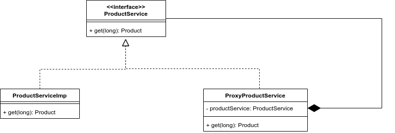

# UML Diagram


Detail:
Here, I added a proxy class for ProductService, which is composing actual ProductService. 
Whenever, ProxyProductService class receives a get request for a product,
first it checks this product from cache if product is not present, then it delegates this request 
to real ProductService and cached this Product and then return this product.

##### Please run the Client.java class, and it will log following information
```log

Getting Product of id 1
Got Product{id=1, title='wpgijsnh'} of id 1
Getting Product of id 5
Got Product{id=5, title='xnvkkoyt'} of id 5
Getting Product of id 3
Got Product{id=3, title='ubvkvyry'} of id 3
Getting Product of id 4
Got Product{id=4, title='npaxforpyr'} of id 4
Getting Product of id 2
Got Product{id=2, title='elvbdw'} of id 2
Getting Product of id 3
Got Product{id=3, title='slrbtbdm'} of id 3
Getting Product of id 2
Got Product{id=2, title='linrvvz'} of id 2
Getting Product of id 1
Got Product{id=1, title='awzjsounnv'} of id 1
Getting Product of id 2
Got Product{id=2, title='wberbteg'} of id 2
Getting Product of id 5
Got Product{id=5, title='ygrltnbh'} of id 5
Getting Product of id 1
Got Product{id=1, title='bkmmofr'} of id 1
Getting Product of id 3
Got Product{id=3, title='qnsixadb'} of id 3
Getting Product of id 3
Got Product{id=3, title='suylaibfdp'} of id 3
Getting Product of id 3
Got Product{id=3, title='nejjvtaup'} of id 3
Getting Product of id 4
Got Product{id=4, title='rpsygpfqpc'} of id 4
Getting Product of id 3
Got Product{id=3, title='xejijzhxll'} of id 3
Getting Product of id 4
Got Product{id=4, title='nswgqmqrfv'} of id 4
Getting Product of id 2
Got Product{id=2, title='nvidiimdne'} of id 2
Getting Product of id 3
Got Product{id=3, title='vhfatqgk'} of id 3
Getting Product of id 3
Got Product{id=3, title='epzdmitzix'} of id 3
----------------------------------------Total Time without proxy: 20050 ms
Proxy: Getting Product of id 2
Product of id 2 is not present in cache
Getting Product of id 2
Got Product{id=2, title='leozmkcl'} of id 2
Proxy: Getting Product of id 2
Product{id=2, title='leozmkcl'} is present in cache
Proxy: Getting Product of id 2
Product{id=2, title='leozmkcl'} is present in cache
Proxy: Getting Product of id 1
Product of id 1 is not present in cache
Getting Product of id 1
Got Product{id=1, title='ddirtqxc'} of id 1
Proxy: Getting Product of id 4
Product of id 4 is not present in cache
Getting Product of id 4
Got Product{id=4, title='lvnoatnkw'} of id 4
Proxy: Getting Product of id 3
Product of id 3 is not present in cache
Getting Product of id 3
Got Product{id=3, title='epnotsv'} of id 3
Proxy: Getting Product of id 5
Product of id 5 is not present in cache
Getting Product of id 5
Got Product{id=5, title='fwurozvsiq'} of id 5
Proxy: Getting Product of id 4
Product{id=4, title='lvnoatnkw'} is present in cache
Proxy: Getting Product of id 4
Product{id=4, title='lvnoatnkw'} is present in cache
Proxy: Getting Product of id 4
Product{id=4, title='lvnoatnkw'} is present in cache
Proxy: Getting Product of id 3
Product{id=3, title='epnotsv'} is present in cache
Proxy: Getting Product of id 1
Product{id=1, title='ddirtqxc'} is present in cache
Proxy: Getting Product of id 2
Product{id=2, title='leozmkcl'} is present in cache
Proxy: Getting Product of id 3
Product{id=3, title='epnotsv'} is present in cache
Proxy: Getting Product of id 5
Product{id=5, title='fwurozvsiq'} is present in cache
Proxy: Getting Product of id 2
Product{id=2, title='leozmkcl'} is present in cache
Proxy: Getting Product of id 3
Product{id=3, title='epnotsv'} is present in cache
Proxy: Getting Product of id 4
Product{id=4, title='lvnoatnkw'} is present in cache
Proxy: Getting Product of id 2
Product{id=2, title='leozmkcl'} is present in cache
Proxy: Getting Product of id 3
Product{id=3, title='epnotsv'} is present in cache
----------------------------------------Total Time with proxy: 5011 ms
```

Thus, Proxy saved around **75%** time.